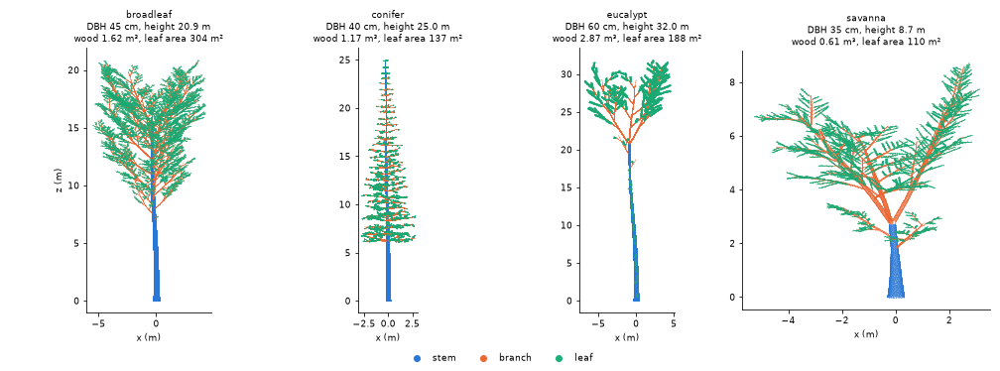
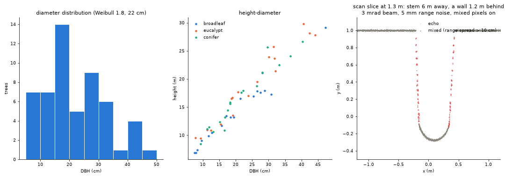

# Synthetic trees, plots and scans

`sylva.synthetic` makes point clouds whose right answer is known, so that a
method can be checked against the truth rather than against another method.
It has two levels.

- **Simple scenes** (`tree`, `forest`, `stand`, `crown_forest`, `scan`,
  `als_flight`, `forest_epochs`): straight cylinder stems with a few limbs and
  loose leaf discs, and a scan that takes the nearest point in each angular
  cell. They are small and fast, the tests and examples are built on them,
  and their output does not change.
- **Realistic scenes** (`tree_model`, `plot`, and `scan` with a finite beam):
  trees with recursive branching, allometric sizes and pipe-model radii,
  leaves of known size and orientation, mixed stands on rough terrain with
  understorey and dead wood, and a scanner with range noise, a beam
  footprint, mixed pixels and multiple returns. Every generated object comes
  with its truth.

## A tree and its truth

```python
import numpy as np
from sylva import synthetic

t = synthetic.tree_model("eucalypt", dbh=0.5, height=30, epicormic=4, seed=1)
t.dbh, t.height                  # 0.5, 29.4  (m; area-equivalent DBH at 1.3 m)
t.wood_volume, t.leaf_area       # 1.867 m³, 135.6 m² (epicormic: 4.2 m²)
t.volume_by_order()              # {0: 1.747, 1: 0.071, 2: 0.035, 3: 0.014}
t.qsm                            # the wood as cylinders: a sylva.qsm.QSM
t.leaves["normal"], t.leaves["area"]
t.leaf_angles().mean_deg         # 63.3 (erectophile: 63.2)
t.leaf_angles().g(np.radians([0, 45, 90]))   # G function: 0.43, 0.48, 0.54
t.points.attrs["label"]          # 2 stem, 3 branch, 4 leaf
```



A tree is grown from an **archetype**:

| archetype | form | leaves |
|---|---|---|
| `broadleaf` | crown from 35 % of the height, ellipsoidal; the stem forks into two limbs at 80 % | planophile, 10 × 5 cm |
| `conifer` | central leader to the top, whorls of five drooping branches from 25 %, conical crown | spherical, 5 × 1.2 cm blades standing in for shoots |
| `eucalypt` | clear bole to 55 %, three ascending limbs from 65 %, sparse crown, noticeable lean | erectophile (pendulous), 15 × 3 cm |
| `savanna` | short bole forking at 30 % into three spreading limbs, wide flat crown | planophile, 4 × 1.5 cm |
| `shrub` | several stems from near the ground (used for the understorey of `plot`) | spherical, 5 × 2.5 cm |

`synthetic.archetype(name)` lists the constants behind each.

**Stem.** The axis leans (`lean`, degrees) and curves smoothly (three
sinusoids per horizontal component, slope amplitude `sweep`). Below the
lowest branch the radius follows `r(s) = R g(s) / g(1.3)` along the stem,
with `g(s) = (1 + b exp(-s / 0.6)) ((S - s) / (S - 1.3))^p`: a taper of
exponent `p` over the stem length `S` with butt swell `b`, so the diameter
at 1.3 m is `dbh` exactly. Options give an elliptical section
(`ellipticity`), bark fissures (`bark_depth`, m), both rescaled to keep the
area of the round section, and buttress flanges (`buttresses`,
`buttress_height`, `buttress_extent`), which add area.

**Branches.** First-order branches leave the stem from the crown base up, in
whorls for the conifer and spirally at 137.5 degrees otherwise, with a
length set by the archetype's crown envelope at their height; forking
archetypes end the stem in codominant limbs. Each axis carries children up
to `max_order` (1 to 4), each a fixed fraction of its parent's length and
shorter towards its tip, at the archetype's branching angle, alternately to
either side; axes bend upwards or droop by a tropism per metre.

**Radii: the pipe model.** Above the lowest branch every segment's
cross-sectional area is proportional to the leaf area it carries
([Shinozaki et al. 1964](../references.md)), `r = c W^(1/e)` with
`e = pipe_exponent` (2 for the pipe model), `c` set so that the radius is
continuous with the stem taper where the crown begins. Area is therefore
conserved at every fork.

**Leaves** are planar elliptical blades of known length and width (area
`π L W / 4`) on the distal 80 % of the terminal twigs. Their number is set by
the leaf area, `leaf_area` or by default `min(lai π R², leaf_k dbh²)` from the
archetype, and their normals are drawn from the leaf angle distribution
`lad`: a de Wit (1965) name (`spherical`, `planophile`, `erectophile`,
`plagiophile`, `extremophile`, `uniform`), `("beta", mu, nu)` with
[Goel and Strebel's (1984)](../references.md) parameters, or
`("ellipsoidal", chi)` ([Campbell 1990](../references.md)), uniform in
azimuth.

**Epicormic shoots** (`epicormic`, shoots per metre of bole) are short leafy
shoots along the bole below the crown, as on eucalypts resprouting after
fire (Tumbarumba). They are flagged in the `epicormic` attribute and in
`leaves["epicormic"]`, so their effect on a QSM (see `stem_radius_cap` in
[QSMs](qsm.md)) or on leaf area can be measured.

**Points** are drawn at `point_density` per m² on a jittered grid (one
random point in each cell of a nearly square grid) on the wood surface and
on one side of each leaf, and carry their surface normal (`normal_x`,
`normal_y`, `normal_z`). The wood points lie exactly on the cylinders of
`t.qsm` (on the shaped section for the stem, whose table radius is the
area-equivalent one), so the table's volume is the volume of the sampled
surface, and `n_points` counts the points on each cylinder.

### The truth

| truth | where |
|---|---|
| wood volume, per order, lengths | `t.qsm` (`total_volume`, `stem_volume`, ...), `t.volume_by_order()`, `t.length_by_order()` |
| leaf area and each leaf | `t.leaf_area`, `t.epicormic_leaf_area`, `t.leaves` (centre, normal, axis, length, width, area, cylinder) |
| leaf angle distribution and G | `t.leaf_angles()` (area-weighted), its `.g(zenith)` |
| DBH, stem position at breast height | `t.dbh`, `t.stem_bh` (a leaning stem is found there, not above its base) |
| height, crown | `t.height`, `t.crown_base`, `t.crown_area` (convex hull from above), `t.crown_extent` |
| per point | `classification` (4 leaf, 5 wood), `label`, `branch_order`, `cylinder`, `leaf`, `epicormic` |

## A plot

```python
p = synthetic.plot(size=30, density=600, dbh=("weibull", 1.8, 0.22),
                   archetypes={"broadleaf": 1, "eucalypt": 1, "conifer": 1},
                   slope=0.15, roughness=0.08, seed=1)
p.stem_density, p.basal_area     # 600 stems/ha, 27.6 m²/ha
p.trees["dbh"], p.trees["height"], p.trees["wood_volume"], p.trees["leaf_area"]
p.qsm(1)                         # the cylinders of tree 1
p.ground_height(x, y)            # the terrain
p.points.attrs["label"]          # 1 ground, 2 stem, 3 branch, 4 leaf, 5 understorey, 6 dead wood
```

`round(density * size² / 10⁴)` diameters are drawn from a **Weibull**
(`("weibull", shape, scale)`) or **reverse-J** (`("reverse_j", mean)`, a
negative exponential above `min_dbh`, de Liocourt's constant quotient)
distribution, or given as a list. Each tree takes an archetype by weight and a
height from the archetype's Chapman-Richards curve
`1.3 + a (1 - exp(-b D))^c` (D in cm; [Richards 1959](../references.md))
with lognormal scatter `height_noise`. Stems are placed at random, largest
first, never closer than `0.75 (D_i + D_j) + 0.2` m, so no two overlap at
the base. The terrain is a plane rising by `slope` per metre towards
`aspect` plus a Gaussian random field of standard deviation `roughness` and
correlation length `roughness_length`. Understorey shrubs, grass tufts,
fallen logs and stumps are scattered over the plot (`shrubs`, `grass_cover`,
`logs`, `stumps`), and nothing is drawn below the ground. The trees are grown
in parallel, each with its own seed, so a seed gives the same plot on any
number of threads.

`p.trees` is the truth table: tree id, archetype, base position, the stem
position at breast height (`x_bh`, `y_bh`), DBH, height above the terrain,
crown base and area, wood, stem and branch volume, and leaf area. The
cylinders, leaves (with their tree) and dead wood are tables too.

## A scan with a finite beam

Giving `scan` any beam option switches from the point-cell scan to a
scanner with a finite beam, cast into the points:

```python
s = synthetic.scan(p.points, origin=(15, 15, 1.5 + p.ground_height(15, 15)),
                   resolution_deg=0.06, scanner="vz400", range_noise=0.005, seed=1)
s.echo_attrs["label"]            # the truth survives into the echoes
s.echo_attrs["range_spread"]     # m; large for a mixed pixel
s.echo_attrs["reflectance"]      # dB; 0 dB is a white target filling the footprint
```

- **Pattern.** Pulses leave on a regular zenith / azimuth grid of step
  `resolution_deg`, from `min_zenith_deg` to `max_zenith_deg`. A scanner
  model (`"vz400"`, `"vz400i"`, `"vz2000i"`) sets the field of view (+60 to
  -40 degrees), beam divergence (0.35 or 0.27 mrad), exit diameter and
  ranging precision from the data sheets (`synthetic.scanner_preset`);
  explicit options override it. Every pulse is kept, misses included, so the
  shots are valid input to ray tracing.
- **Footprint.** A pulse is a cone of full divergence `beam_divergence`
  (mrad) from an aperture of `exit_diameter`, sampled by `footprint_samples`
  equal-energy sub-beams on a sunflower pattern ([Vogel 1979](../references.md)).
  Each point stands for a small patch of surface of radius `target_radius`
  (by default 1.75 times the median point spacing): a disc facing along the
  point's normal, or a sphere where no normal is known. Discs seen edge-on
  are not hit, so silhouettes stay sharp.
- **Echoes.** Hits closer in range than `echo_separation` (the receiver's
  range resolution) form one echo; with `mixed_pixels` its range is the
  energy-weighted mean of the hits' ranges (energy: the sub-beam's share
  times the target's `reflectance`). A footprint that straddles an edge thus
  puts a point in the gap between foreground and background, as real mixed
  pixels do; hits farther apart give separate returns (multiple returns
  within a footprint). Echoes below `detection_threshold` are lost and at
  most `max_echoes` are kept, nearest first.
- **Noise.** Gaussian range noise of standard deviation `range_noise`, or
  `a + b R` for `range_noise=(a, b)`, is added along the beam.



The right panel scans a stem 6 m away with a wall 1.2 m behind it, with a
3 mrad beam (wider than any real scanner's, to make the effect visible), 5 mm
range noise and mixed pixels on: the red echoes, whose hits spread over more
than 10 cm in range, trail from the stem's edges towards the wall.

## Checks against the truth

The test suite (`tests/test_synthetic_model.py`) checks that:

- wood and leaf points lie on their cylinders and blades, the cylinder table
  gives the volume per order and in total, the leaf table gives the leaf
  area, and area is conserved at every fork;
- a bare stem is the analytic cone of its taper to 1 %;
- the leaf inclinations follow the requested distribution (mean against the
  analytic mean, a Kolmogorov-Smirnov test for the beta case) and the G
  function of the generated leaves matches the textbook distribution's to
  0.01; azimuths are uniform;
- a plot has the requested number of stems, its diameters follow the
  truncated Weibull or reverse-J distribution (Kolmogorov-Smirnov), heights
  follow the allometry, stems do not overlap, and the terrain has the
  requested slope and roughness;
- the scanner's range noise has the requested standard deviation (constant
  and range-dependent), the number of mixed pixels at an edge follows the
  footprint size and angular step, none appear without mixing or with a
  finer range resolution (two returns instead), and the reflectance of a
  target filling the footprint is its own;
- a seed gives the same tree, plot and scan, and the simple scenes are
  unchanged (the parity recordings pass).

Sylva's own tools on a 30 × 30 m plot of 54 trees (broadleaf, eucalypt,
conifer) scanned from five positions with the VZ-400 model at 0.06 degrees
and 5 mm noise: `trees.detect_stems` found all 54 stems, with a DBH bias of
+0.5 cm and an RMSE of 0.6 cm; `leaves.classify_leaf_wood` reached 0.91 to
0.97 accuracy on the three largest trees; `qsm.build_qsm` on the true wood
echoes recovered 51 to 97 % of the four largest trees' wood volume, mostly
the stem, as the scans see little of the crowns' small branches.

## Limitations

- The trees are architectural models, not grown ones: branch angles and
  lengths follow fixed rules with random scatter; there is no competition
  between crowns, no dead branches, and conifer needles are small planar
  blades standing in for shoots.
- The scanner casts beams into points, not surfaces. A point stands for a
  patch of radius `target_radius`, so anything thinner than that radius
  (twigs, grass, leaf edges) is seen thicker than it is, and a surface
  sampled with independent random points rather than a jittered grid lets
  a few sub-beams through. The default radius is set from the median spacing
  over the whole scene; where densities differ a lot, give `target_radius`.
- Range noise is Gaussian; there is no intensity-dependent ranging bias, no
  atmospheric attenuation and no waveform shape (see
  [Full waveforms](waveform.md) for those).
